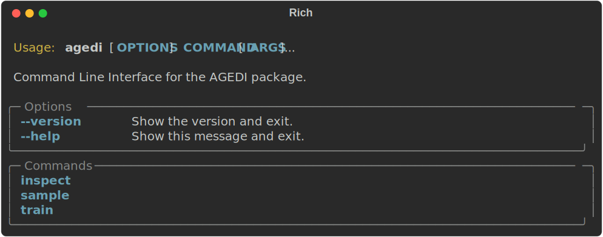

Command Line Interface
======================
After installing AGeDi try running

.. code-block:: console
		
   agedi --help

The will look like

The CLI exposes the two main functionalities namely training and
sampling the model. To inspect the possibilities within each try

.. code-block:: console
		
   agedi train --help

and

.. code-block:: console
		
   agedi sample --help

