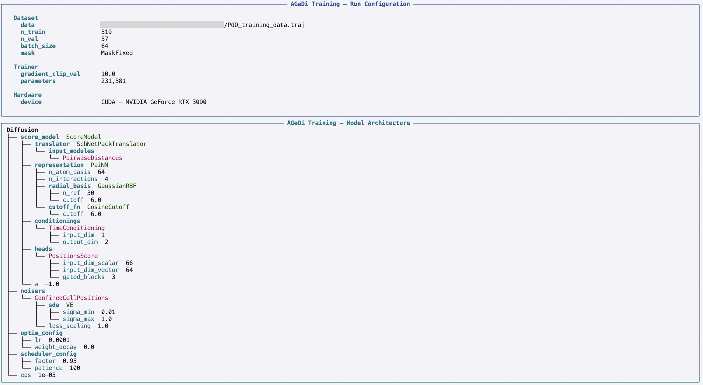
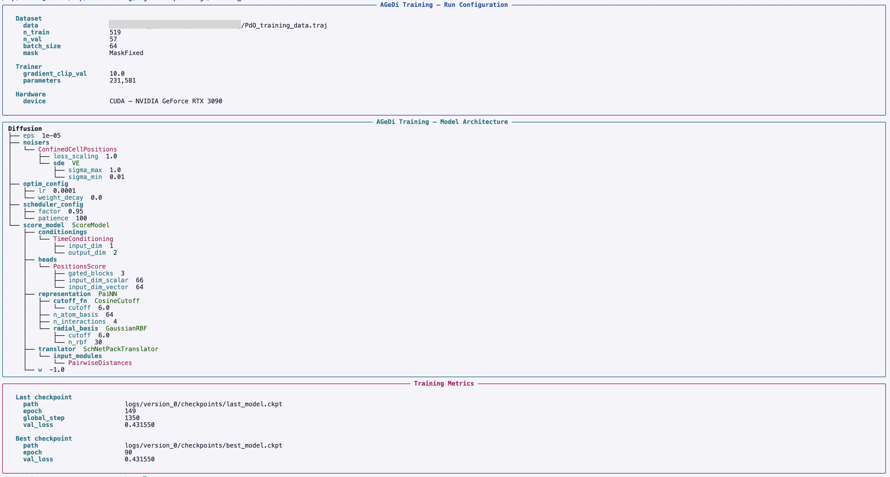

PdO-on-Pd end-to-end example
============================

This reproduces the surface-generation workflow used in Ref. [1] for a
simple PdO surface system. 

Download tutorial data
----------------------

Training data

.. code-block:: console

   wget https://github.com/nronne/agedi/raw/refs/heads/main/docs/tutorial_data/PdO_training_data.traj

Pd template surface for sampling

.. code-block:: console

   wget https://github.com/nronne/agedi/raw/refs/heads/main/docs/tutorial_data/template.traj

   
Train
-----

For this surface system with Z-confined adsorbates we use the
``ConfinedCellPositions`` noiser, which pairs a
:class:`~agedi.diffusion.distributions.UniformCellConfined` prior with a
:class:`~agedi.diffusion.distributions.TruncatedNormal` noise distribution.

Using the CLI:

.. code-block:: console

   agedi train -t 3 --noisers ConfinedCellPositions --mask MaskFixed --confinement 2 10 PdO_training_data.traj

Notes:

- ``MaskFixed`` maps ASE ``FixAtoms`` constraints to the graph mask.
- Confinement applies to z-coordinates and is useful for slab/surface tasks.
- Use ``ConfinedCellPositions`` together with ``--confinement`` for
  surface/slab systems; ``Positions`` for gas-phase clusters.
- Outputs are written in ``logs/version_0`` (or next available
  version).

This should produce an overview of the architecture like shown below,
and then start training.

During training, you can inspect the progress using Tensorboard (or
WandB).

After training you can always inspect the model using

.. code-block:: console

   agedi inspect logs/version_0

This should produce an output similar to the one shown below

   
Again, we can also use the Python API:

.. code-block:: python

   from ase.io import read
   from agedi import train_from_atoms

   data = read("PdO_training_data.traj", ":")

   diffusion, dataset, trainer = train_from_atoms(
       data,
       noisers=("ConfinedCellPositions",),
       mask="MaskFixed",
       confinement=(2.0, 10.0),
       max_time=3,  # hours
       log_dir="logs",
   )

Or more explicitly:

.. code-block:: python

   from ase.io import read
   from agedi import create_diffusion, create_dataset, create_trainer, train

   data = read("PdO_training_data.traj", ":")
   
   diffusion = create_diffusion(
       noisers=("ConfinedCellPositions",),
   )
   
   dataset = create_dataset(
       data,
       mask="MaskFixed",
       confinement=(2.0, 10.0)
   )
   
   trainer = create_trainer(
       max_time=3,  # hours
       log_dir="logs"
   )
   
   train(diffusion, dataset, trainer=trainer)

Sample
------

Using the CLI:

.. code-block:: console

   agedi sample logs/version_0 -f Pd2O2 --template_path template.traj --confinement 2 10

This writes sampled structures to ``sampled.traj``.

Using the Python API:

.. code-block:: python

   from ase.io import read, write
   from agedi import load_diffusion, sample, AtomsGraph

   diffusion = load_diffusion("logs/version_0")
   
   template = AtomsGraph.from_atoms(read("template.traj"), confinement=(2.0, 10.0))

   structures = sample(
       diffusion,
       n_samples=12,
       formula="Pd2O2",
       template=template,
       confinement=(2.0, 10.0),
       steps=500,
   )

   write("sampled.traj", structures)

References
----------

[1] N. Rønne, A. Aspuru-Guzik and B. Hammer. *Phys. Rev. B* **110**, 235427 (2024):
   https://doi.org/10.1103/PhysRevB.110.235427
